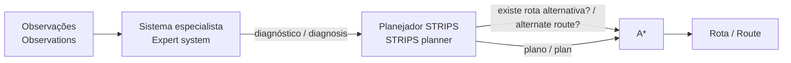
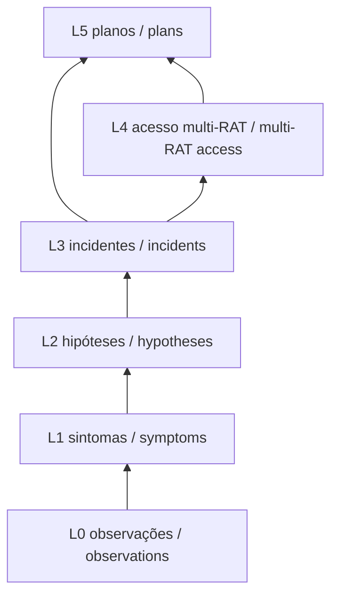

# Arquitetura / Architecture

O pacote `aisg` (em `software/aisg/`) reúne os componentes de decisão. Cada um é independente e todos compartilham o mesmo modelo de domínio.
The `aisg` package (under `software/aisg/`) holds the decision components. Each is independent, and all share the same domain model.

| Módulo / Module | Responsabilidade / Responsibility | Experimento / Experiment |
|---|---|---|
| `domain/` | Topologias sintéticas e modelo de custo / Synthetic topologies and cost model | todos / all |
| `expert_system/` | Motor de inferência (progressivo e regressivo, fatores de certeza) e base de conhecimento / Inference engine (forward and backward, certainty factors) and knowledge base | 001 |
| `planning/` | STRIPS, GPS, planejador A\*, grafo de planejamento / STRIPS, GPS, A\* planner, planning graph | 001 |
| `search/` | A\* e estratégias não informadas / A\* and uninformed strategies | 001 |
| `blackboard/` | Quadro-negro, especialistas, controlador, cenários / Blackboard, experts, controller, scenarios | 002 |
| `eco/` | Motor de eco-resolução, mundo dos blocos, fluxos da rede / Eco-resolution engine, Blocks World, network flows | 003 |
| `simulation/` | Exportação do backhaul para o ns-3, leitura da telemetria medida de volta como observação e repetição causal que aplica as ações inferidas / Export of the backhaul to ns-3, reading measured telemetry back as observations, and the causal replay that applies the inferred actions | 004 |
| `observation.py`, `prometheus.py` | Registros de observação e coleta de evidência; o mesmo formato traz a telemetria medida do 004 de volta ao quadro-negro / Observation records and evidence collection; the same format carries 004's measured telemetry back to the blackboard | 001, 004 |
| `cli.py` | Interface de linha de comando / Command-line interface | todos / all |

Como os quatro experimentos se encadeiam — casos declarados alimentando 001–003, o 004 como experimento integrador e o retorno da telemetria medida — está no [README](../README.md#como-os-experimentos-se-encadeiam--how-the-experiments-chain), com a justificativa da ordem em [`research/methodology.md`](../research/methodology.md).

How the four experiments chain — declared cases feeding 001–003, 004 as the integrating experiment, and the measured telemetry returning — is in the [README](../README.md#como-os-experimentos-se-encadeiam--how-the-experiments-chain), with the order's justification in [`research/methodology.md`](../research/methodology.md).

## Encadeamento de um incidente / Single-incident chain

## Quadro-negro sobre a rede / Blackboard over the network

Nenhum especialista chama outro: todos leem e escrevem no quadro, e o controlador escolhe um especialista por ciclo. Ver [experimento 002](../experiments/002-multi-expert-blackboard/).
No expert calls another: all read and write the board, and the controller picks one expert per cycle. See [experiment 002](../experiments/002-multi-expert-blackboard/).

## Regras de projeto / Design rules

- Núcleo sem dependências de terceiros. / Core without third-party dependencies.
- Limiares e parâmetros declarados num bloco, nominais e não calibrados. / Thresholds and parameters declared in one block, nominal and uncalibrated.
- Toda conclusão carrega sua justificativa (regras, suporte, autor). / Every conclusion carries its justification (rules, support, author).
- Modelo de domínio sintético: ver [domain-model.md](domain-model.md). / Synthetic domain model: see [domain-model.md](domain-model.md).

## Contrato compartilhado / Shared contract

[Diagnosis contract](diagnosis-contract.md): `domain/diagnoses.py` owns diagnosis identifiers, repair literals, routing and eco effects, and explicit simulator capabilities. Existing component mappings are derived from this registry. / O registro central define diagnósticos e capacidades; as tabelas dos componentes são derivadas dele.
